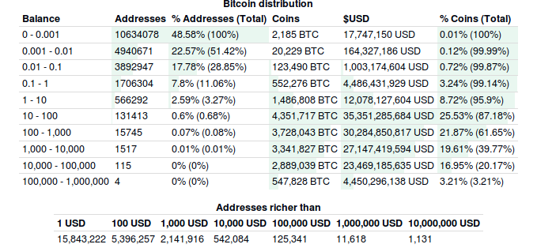
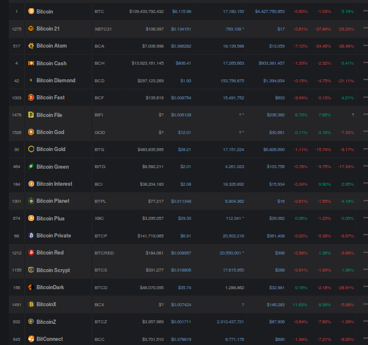
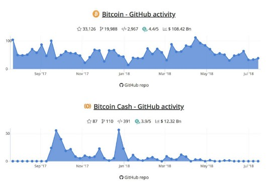
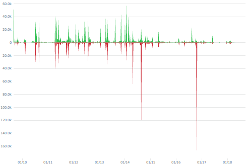
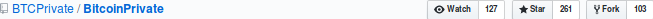

Jul 27, 2K18 | *4 min. read*

#### By Nikolai

Sub-hosted at [itsN1X/0x7981_fff_btcp](https://itsN1X.github.io/0x7981_fff_btcp)

###### View this article on [N1X.site](https://n1x.site/0x7981_fff_btcp/) or Nikolai's a.k.a. `@DrHushChuks`' Medium.com [article](https://medium.com/@DrHushchak/hi-for-sure-youve-already-heard-the-news-that-the-application-for-the-etf-futures-bitcoin-have-e910943b31b) .

----

Hi again,

Surely you must’ve already heard the news that the application filed for the Bitcoin ETF-futures (Exchange Traded Funds) by the Winklevoss twins has been cancelled by the U.S. SEC.  

`
With Bitcoin Private, you’re entirely in control and embracing a bright new future with cryptocurrencies, join us and be at the forefront of the new era of digital currency usage.
`
###### — Matt Pass.

First of all, I'll attempt to explain some vital things related to *"The SEC"*.

These United States' regulatory agencies are fully aware that once this ETF door is ajar, it is going to create a flood of submissions and approvals, news and products, in every color & shade, specification & denomination connected to the crypto world. Their obvious evaluation would typically commence with *Who needs it?* Again they'd answer in unison - *The scammers, drug dealers, people who do not want and do not know how to work, or the ones who are hiding, and probably evading taxes.* But, one may ask, *"How does the crypto-community view this situation around the ETFs?* Put very simply, Bitcoin is not worthy of any regulations, approvals or confirmations at all! 

Now you might think that I’m just shilling on bcash - Nope, you are wrong.
I had been myself invested into Bitcoin, until I discovered something more meaningful, more disruptive -- **The Bitcoin Private.**
I’m already looking forward to many whiners that will be running FUD down the throats of innocent investors. Wait a minute, and have a look at my **5 reasons** as to why the BTCP fares superior.

### 1) The task of SEC is to protect investors.

Let's peek at the bitcoin *richlist* below.

  

How on Earth can you protect investors when 116 addresses (out of ?, `=<116` wallets) have 2/5th (~40%) of all the bitcoin? In that sense, the SEC approving should make some handful of rich guys even more richer in advance, besides, no one knows if the owner of half of them is just one person! Bitcoin has future only if is these "big players" sell all their BTC savings, reconsidering the fact that they all are already millionaires, if not billionaires. In doing so, they would greatly facilitate the fate of bitcoin. But most likely this will not happen and every year people will first expect, and then wonder why the securities comission would not support the initiative in setting up legal regulations for crypto currencies.

But here, on the contrary, we have **Bitcoin Private** `$BTCP`, which does not lobby interests of a certain circle of people, and is actually open to the cryptocurrency community. Evidence speaks out loud by means of the numerous articles published accross both the internets, with a multitude of reporting on the time & resources spent by the team, voting on asic resistance, provenance of untracebility, immutability and so on.

### 2) The overvalued bitcoin and its bitcoin 'forks'.

ETF futures are not just guessing over playing cards, or betting on sports. Here you need to put real money. And who with the SEC can promise that after obtaining permission old players will not start to pick up the price and that then there will be demand for bitcoin. Roughly speaking, if there is no demand, then who will buy bitcoin from those who used the etf tool, which is then more expensive?

  

Another thing is when there is bitcoin with the code of the latest updates, in addition implemented by zk-snarks technology for just 7$!. Its 1000 times cheaper. Here it is very important to understand that a lot of investors are being led around by those 116, or less, owners of the biggest bitcoin wallets. My relatives, please, wake up, with such money, you buy experts, developers, members of the government, anyone! But when you're buying everything except for BTCP, you behave like children, to whom when explained what is good, what is bad, but are not yet able to analyze the information, and engender the choices of the masses.

### 3) Distinctive features against other forks of Bitcoin.

Why *Bitcoin*, and not something else and if Bitcoin, then why "Private"?

Jack Liao says, `Equihash and decentralization.` and Roger K. Ver says, `Block size, nothing more comes to mind.` But facts-in-check, **Bitcoin Private** is not represented by one person, does not have people prepared in advance for it, and everything that is built here *is* by the hands of the people themselves, i.e. the $BTCP community itself.
The 'Privacy' protocol, the rebase to bitcoin code, the possibility of implementing a private network atop the lightning network, etc.. Whoever told you that this is not a real bitcoin has definitely been lying, and you must choose only between Bitcoin and Bitcoin Private. The confirmation becomes apparent in the next paragraph.

### 4) The Developer activity on Github.

Oneof the more points, which The SEC must necessarily pay attention to. GitHub activity is an interesting metric when analyzing ICOs and crypto projects. Developers’ time is a relatively expensive resource and if a given project has a lot of developers dedicating their time and skills, it could mean several things:

  

* These people believe that the project will be successful;
* The project is shipping more features;
* There is a less probability the project might just be an exit scam;

Here you can evaluate the results of analysis of developer activity on Github:

261 stars vs 87 in Bcash. AND! Last time I checked, the devs of BTCP were working day’n’night on code rebasement.

  

And Bcash — no activity since end of May.

# 5) The daily usage.

Recently, Bitcoin Private launched the project [Cointigo.io](https://Cointigo.io) which allows **without Internet**, access to send or receive BTCP via SMS. There is even a PoC for a POS running over the BTCP network.

And on July 31 BTCPPay, in which I see a great perspective, this is supplemented by the creation of credit cards based on the blockchain.

## Final words

Much like traditional payment processors, BTCP Pay offers cryptocurrency as a payment solution, which was always deemed to be the use of the original Bitcoin and its obviously something we’re keen to make happen with Bitcoin Private. We safely, securely and privately handle payments through our blockchain, with speed, efficiency and extremely low cost, it’s incredibly quick and easy to setup in a variety of scenarios and both simple and fast for users to use. The customer never leaves your site and we store no personally identifiable information about your users or purchases, again putting you in control.

### BTCP*Pay*

* Register as a `merchant` at: 
<https://btcppay.com/>

* Documentation apropos BTCP*Pay*:
<https://docs.btcppay.com/>

### Some Official Links

* Official Website:
<https://btcprivate.org>

* Paper Wallet:
<https://paperwallet.btcprivate.org>

### BTCP Quicklinks

Others | link
---- | ----
News Group : | [Telegram](https://t.me/bitcoinprivatenews)
Handle : | [Twitter](https://twitter.com/bitcoinprivate)
Subbie : | [Reddit](https://reddit.com/r/BTC_Private)
Chat : | [Discord](https://discord.gg/CVXyGQj)
Telegram : | [Russian`l10n`](https://t.me/bitcoinprivaterussia)
Video: | [Youtube](https://www.youtube.com/watch?v=-85GAhCK5Dg)
